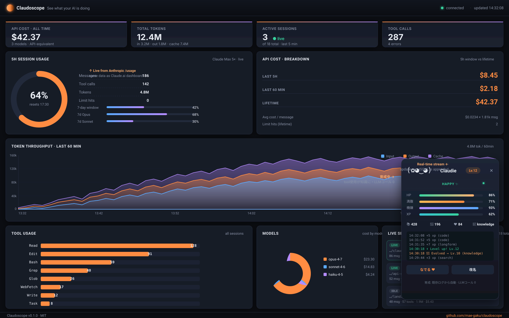

# Claudoscope

> A real-time observability scope for [Claude Code](https://claude.com/claude-code) — see what your AI is doing.



`Claudoscope` watches your local `~/.claude/projects/**/*.jsonl` session logs *and* fetches your actual Claude subscription quota from Anthropic, then renders a live Grafana-style dashboard at `http://localhost:4317`. No prompt content leaves your machine — only your existing OAuth token is reused to read the same `/usage` numbers that the official Claude UI shows.

The dashboard updates in real time as Claude works — and a tamagotchi-style **AI Companion** in the corner grows from the same activity stream, deriving every nutrient from your existing JSONL events. **Zero extra LLM calls. Zero extra tokens.**

```
$ npx claudoscope
  Claudoscope dashboard ready
    > Local:    http://127.0.0.1:4317
    > Watching: /home/you/.claude/projects
    > Press Ctrl+C to stop
```

## Features

- **Live 5-hour session gauge** — the same `five_hour.utilization` number Claude.ai shows. Pulled directly from Anthropic via your existing Claude Code OAuth token, refreshed every minute.
- **7-day quota bars** — overall, plus Opus / Sonnet breakdown when available.
- **KPIs** — API-equivalent cost, total tokens (in / out / cache), active sessions, tool calls.
- **Token throughput timeline** — stacked area chart of input / output / cache tokens over the last 60 minutes.
- **Cost & activity timeline** — per-minute USD cost overlaid on message count.
- **Tool usage** — horizontal bar chart of which tools Claude is actually using.
- **Model breakdown** — cost distribution across Opus / Sonnet / Haiku (synthetic limit-hit notices are filtered out).
- **Live sessions** — per-session cards with cwd, git branch, last message, last tool, message/token/cost counters.
- **Project table** — `cwd` rollup of every directory Claude Code has touched.
- **API cost panel** — last 5h / last 60min / lifetime, plus average cost per assistant message and rate-limit hit count.
- **Live event stream** — newest events first, like `tail -f` for your assistant.
- **AI Companion (zero-LLM pet)** — a tamagotchi-style character in the bottom-right corner that grows from your real Claude Code activity. Tool calls become knowledge, long messages become creativity, sustained use earns XP. **No LLM calls, no extra tokens** — every nutrient is derived deterministically from the JSONL events Claudoscope already parses.

Everything updates in real time as new lines are appended to JSONL files. No refresh button.

### AI Companion — how it grows without spending tokens

The companion follows the 魂と声の分離 ("soul / voice separation") design from `ai_companion_spec.html`: only the 魂 (state) is implemented. The 声 (LLM-generated dialogue) is intentionally omitted, so growth costs **zero extra tokens**. The engine is a set of pure functions in [`src/companion.js`](./src/companion.js) — given an event and a state, return the next state.

| Activity                                  | Becomes               | Boosts                       |
|-------------------------------------------|-----------------------|------------------------------|
| Read / Edit / Write / Bash tool calls     | Protein               | Knowledge, HP                |
| WebFetch / WebSearch                      | Vitamins              | Knowledge, Creativity        |
| Long-form messages (>600 chars)           | Long-form nutrient    | Creativity, XP bonus         |
| Casual chat                               | Water                 | Affection, Mood              |
| Tool errors                               | (stress)              | Mood ↓                       |
| Rate-limit hits (`<synthetic>` messages)  | (frustration)         | Mood ↓ + limit-hit counter   |
| Idle > 4h / 24h                           | (state transition)    | Sleepy → sulking             |

Level milestones at Lv.5 / 10 / 20 / 50 trigger evolution. The branch (`knowledge` / `creative` / `social` / `balanced`) is decided by whichever status was dominant at the moment of evolution. Click **なでる** to give your companion attention manually. State persists to `~/.claudoscope/character.json` — delete that file to start over.

## Install

Requires Node.js 18+.

```bash
# Run without installing (once published to npm)
npx claudoscope

# Or install globally
npm install -g claudoscope
claudoscope
```

### Running from a clone (pre-release)

While Claudoscope is not yet on the npm registry, run it directly from a clone:

```bash
git clone https://github.com/mae-gaku/claudoscope.git
cd claudoscope
npm install
node bin/claudoscope.js        # or: npm start

# Optional: expose as a global `claudoscope` command
npm link                        # creates a symlink in your global bin
claudoscope                     # works from anywhere now
# Undo with: npm unlink -g claudoscope
```

## Usage

```
claudoscope [options]

Options:
  -p, --port <port>          Port to listen on (default: 4317)
      --host <host>          Host to bind (default: 127.0.0.1)
      --no-open              Do not open browser automatically
      --projects-dir <path>  Override Claude projects dir (default: ~/.claude/projects)
      --plan <name>          Fallback plan for the 5h gauge when live data is unavailable:
                             api | pro | max5 | max20 (default: api)
      --budget <usd>         Fallback 5h-window budget in USD (overrides --plan)
  -v, --version              Print version and exit
  -h, --help                 Print this help
```

### Live quota source

The 5-hour and 7-day percentages in the gauge come from Anthropic's official endpoint:

```
GET https://api.anthropic.com/api/oauth/usage
Authorization: Bearer <your Claude Code OAuth token>
```

Claudoscope reads `~/.claude/.credentials.json` (the same file Claude Code itself uses), reuses the existing access token, and refreshes every 60 seconds. **Nothing new is uploaded** — this is the exact same call the `/usage` slash command and Claude.ai dashboard make.

If you're an API-key user (no Claude Pro / Max subscription) or the token can't be read, Claudoscope falls back to its local estimator using cost-vs-budget from `--plan` / `--budget`.

### Subscription vs API billing

Claude Code has two billing modes and Claudoscope shows useful numbers for both:

| You pay by | What "cost" means here | Source of the gauge |
|---|---|---|
| **API** (pay-per-token) | Your actual bill | Local estimate vs `--budget <usd>` |
| **Pro / Max subscription** | API-*equivalent* cost (what the same usage would have cost on the API) | **Live Anthropic 5h utilization** |

Local fallback plan presets when live data isn't available:

| `--plan` | Subscription            | 5h budget (approx) |
|----------|-------------------------|-------------------:|
| `api`    | None (pay-per-token)    | $0 (no gauge)      |
| `pro`    | Claude Pro ($20/mo)     | $10                |
| `max5`   | Claude Max 5× ($100/mo) | $50                |
| `max20`  | Claude Max 20× ($200/mo)| $200               |

### Windows + WSL

If you run Claude Code inside WSL, Claudoscope works out of the box: it reads `~/.claude/projects` from the WSL side and opens the dashboard via `wslview` or `xdg-open`. You can also point a Windows browser at the same URL — the server binds to `127.0.0.1` by default; pass `--host 0.0.0.0` if you need cross-VM access.

### Reading another machine's logs

```bash
# Sync ~/.claude/projects from a remote dev box, then point Claudoscope at it
claudoscope --projects-dir /mnt/synced/.claude/projects
```

## How it works

```
  Claude Code              Claudoscope (Node)              your browser
  ───────────              ────────────────────            ─────────────
  ~/.claude/projects/  ──► chokidar file watcher  ──┐
   <session>.jsonl         JSONL parser              │     SSE /api/stream
                           1s coalesced aggregate    ├──►  Chart.js
  ~/.claude/.credentials ─► OAuth usage poller       │     live tables
                           (every 60s)              ─┘
```

- **Watcher**: `chokidar` watches `~/.claude/projects` recursively. Each `*.jsonl` is treated as a session; Claudoscope remembers the byte offset and only reads newly appended lines.
- **Parser**: every line is normalized into one event (`user_message`, `assistant_message`, `tool_result`, etc.) with token usage and computed USD cost.
- **Quota poller**: reads `~/.claude/.credentials.json`, calls `/api/oauth/usage`, caches the result, emits it over SSE.
- **Store**: events are kept in memory and aggregated into a snapshot once per second.
- **Server**: a tiny zero-framework Node HTTP server exposes `/api/snapshot`, `/api/events`, `/api/usage`, and `/api/stream` (SSE).
- **UI**: vanilla JS + Chart.js — no build step.

The only runtime dependency is [`chokidar`](https://www.npmjs.com/package/chokidar). The browser pulls Chart.js from a CDN.

## Pricing model

Claudoscope computes per-event cost using a hand-maintained price table in [`src/pricing.js`](./src/pricing.js):

| Model family    | input / 1M | output / 1M | cache read / 1M | cache write (5m) | cache write (1h) |
|-----------------|-----------:|------------:|----------------:|-----------------:|-----------------:|
| Opus 4 / 4.7    | $15.00     | $75.00      | $1.50           | $18.75           | $30.00           |
| Sonnet 4 / 4.6  | $3.00      | $15.00      | $0.30           | $3.75            | $6.00            |
| Haiku 4 / 4.5   | $1.00      | $5.00       | $0.10           | $1.25            | $2.00            |

If Anthropic changes pricing, just edit one map. PRs welcome.

## Privacy

Claudoscope is **strictly local**. It:

- reads only files under `~/.claude/projects` (or `--projects-dir`)
- reads `~/.claude/.credentials.json` only to grab the OAuth access token
- makes exactly one outbound HTTPS call: `GET api.anthropic.com/api/oauth/usage` — the same call Claude.ai makes
- listens only on `127.0.0.1` by default
- has no analytics, telemetry, or background uploads to anyone else

Your prompts and outputs never leave your machine.

## Roadmap

- [ ] Per-session detail view (drill into a single session's transcript)
- [ ] Configurable timeline windows (1h / 6h / 24h / 7d)
- [ ] Export snapshot as JSON / CSV
- [ ] Budget alerts (`--budget 5.00` warns when daily spend exceeds threshold)
- [ ] Desktop notification when 5h utilization crosses 80% / 95%
- [ ] Team mode: aggregate multiple developers' logs from a shared mount
- [ ] Plugin API for custom panels

## Business model

Claudoscope is MIT-licensed and free to use forever for individuals. The OSS tool is the entire product for solo developers.

If we build commercial offerings on top, they will live in a separate `claudoscope-cloud` repo and the open-source CLI will keep working without them. Likely candidates:

- **Team plan** — managed multi-user dashboard, SSO, per-seat cost attribution, Slack/PagerDuty budget alerts, retention beyond the local disk.
- **Self-hosted Enterprise** — same product, deployable into your VPC, with audit logging and RBAC.
- **Anonymous benchmark** — opt-in aggregated metrics ("how does my token spend compare to other Opus users?").

The open-source CLI will never gate features behind a license check and will never phone home.

## Contributing

```bash
git clone https://github.com/mae-gaku/claudoscope.git
cd claudoscope
npm install
npm test           # node --test
npm run dev        # start with --no-open
```

Issues and PRs welcome. Please keep the runtime dependency list tiny — Claudoscope should stay `npx`-friendly.

## License

[MIT](./LICENSE)
